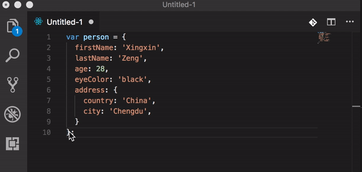

# Sort JS Object Keys README

This is a VS code extension to alphabetically sort the keys in _selected_ js objects keys in your code. 

It supports:
- The latest ECMAScript version enabled by default (ES2017).
- Typescript.
- Comment attachment.

## Usage

1. Select a js object in your source  
  Note: it uses full lines so ensure the selected lines are a valid js object, start from the "{" and end from the "}"
1. Run the extension command  
    * Sort JS object keys  
    Keybinding: `Alt+S`
    * Sort JS object keys (Reverse)

## Reference

Use [@babel/parser](https://babeljs.io/docs/en/next/babel-parser.html) to parse the code, and sort the parsed code, then use [@babel/generator](https://babeljs.io/docs/en/next/babel-generator.html) to genertate the code back to document